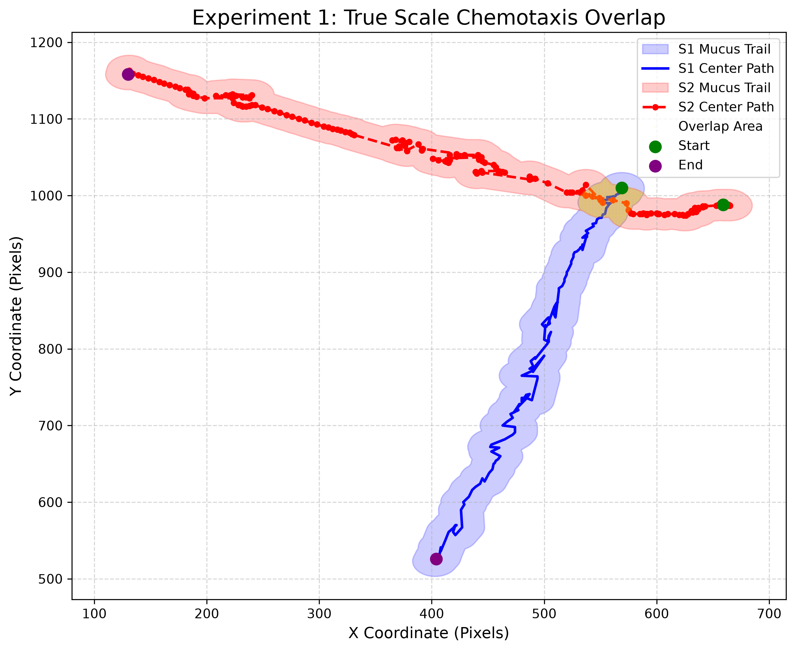

# Bio-Vision: Quantitative Chemotaxis Trajectory & Spatial Behavioral Analytics Pipeline

[](https://www.python.org/)
[](https://docs.ultralytics.com/)
[](https://shapely.readthedocs.io/)

An automated computer vision and computational behavioral analytics pipeline designed for tracking biological targets from video streams, interpolating missing temporal frames, modeling physical mucus trails using 2D topological buffering, and quantifying spatial-temporal chemotaxis overlaps.

---

##  Input Video Streams & Real-time Tracking

The pipeline processes dual-subject behavioral videos to dynamically locate targets and extract continuous 2D trajectories:

|  Snail 1 (S1) Tracking Video |  Snail 2 (S2) Tracking Video |
| :---: | :---: |
|  |  |
| *File: `1-1_complete.csv` (Primary Target)* | *File: `1-2_complete.csv` (Secondary Target)* |

>  **Sample Demonstration Notice:**  
> To keep the repository lightweight, this repository includes sample raw video/frame sequences and coordinates for **Experiment 1** (`1-1` and `1-2`) to demonstrate full pipeline execution. The full dataset across all 36 dual-subject experiments is available upon request.

---

##  Pipeline Overview

This codebase processes raw video streams through the following automated workflow:
1. **Target Localization**: Uses **YOLOv8-World** zero-shot object detection to extract frame-by-frame bounding boxes for both organisms.
2. **Missing Frame Interpolation**: Cleans raw coordinates and applies linear interpolation to generate complete continuous trajectory coordinates.
3. **Topological Mucus Modeling**: Constructs physical 2D buffered geometries ($r=20\text{ px}$) along the trajectory paths using `Shapely`.
4. **Spatial Overlap Analytics**: Calculates pixel-level intersection zones, total trail overlap lengths, and percentage mucus overlap areas ($Pct_{area}$).

---

##  Visual Mapping Output

The processed trajectories, physical mucus buffer zone ($r=20\text{ px}$), and spatial overlap intersection zones (Yellow) are rendered onto a globally scaled unified map:

<p align="center">
  
</p>

---

##  Final Quantitative Output (CSV Preview)

*(Note: The table below displays sample placeholder data for illustration purposes. Running `src/03_calculate_overlap.py` will generate the actual `all_experiments_overlap_summary.csv` file).*

| Exp_ID | Total_S1_Area (sq px) | Total_S2_Area (sq px) | Overlap_Area (sq px) | Total_S2_Length (px) | Overlap_Length (px) | Area_Overlap_Pct (%) | Overlap_Pixel_Count |
| :---: | :---: | :---: | :---: | :---: | :---: | :---: | :---: |
| **1** | 45280.50 | 41230.10 | **8450.25** | 1240.50 | 250.10 | **20.49%** | **8451** |
| **2** | 38920.00 | 39800.40 | **3120.80** | 1180.20 | 95.40 | **7.84%** | **3121** |
| **3** | 42100.20 | 44150.00 | **12450.60** | 1310.00 | 380.50 | **28.20%** | **12451** |
| ... | ... | ... | ... | ... | ... | ... | ... |

*(Full per-experiment pixel coordinates are exported to `./outputs/experiment_overlapping_pixels/`)*

---

##  Quick Start

### 1. Installation
```bash
git clone [https://github.com/YourUsername/BioVision-Snail-Tracking.git](https://github.com/YourUsername/BioVision-Snail-Tracking.git)
cd BioVision-Snail-Tracking
pip install -r requirements.txt
### 2. Execution Pipeline

**Step 1: Detection & Trajectory Interpolation**
```bash
python src/01_detect_and_interpolate.py
**Step 2: Generate Scaled Trajectory Plots
```bash
python src/02_plot_trajectories.py
**Step 3: Calculate Spatial Overlap & Master CSV Summary
```bash
python src/03_calculate_overlap.py
