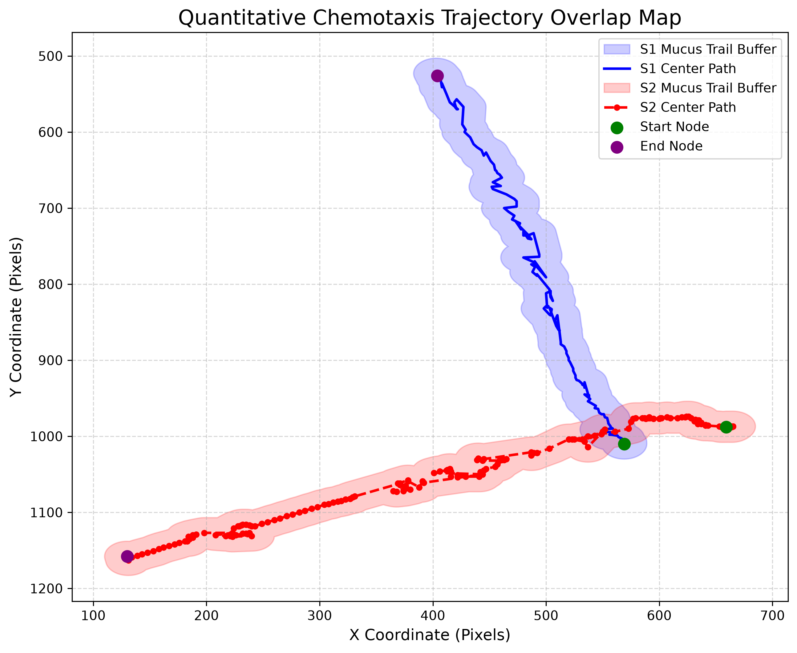

# Bio-Vision: Quantitative Chemotaxis Trajectory & Spatial Behavioral Analytics Pipeline

[](https://www.python.org/)
[](https://docs.ultralytics.com/)
[](https://shapely.readthedocs.io/)

An automated computer vision and computational behavioral analytics pipeline designed for tracking biological targets, interpolating missing temporal frames, modeling physical mucus trails using 2D topological buffering, and quantifying spatial-temporal chemotaxis overlaps.To keep the repository lightweight, data/ contains a sample frame sequence and interpolated coordinates for Experiment 1 to demonstrate pipeline execution. The full dataset across all 36 experiments is available upon request.

---

## Key Features & Methodologies

1. **Computer Vision Target Detection**:
   - Deploys **YOLOv8-World** zero-shot object detection to locate low-contrast biological targets across frame sequences.
2. **Data Cleaning & Linear Interpolation**:
   - Handles occlusion and missing frames by constructing full-sequence temporal dataframes and applying linear numerical interpolation via `pandas`/`numpy`.
3. **Global-Scale Trajectory Normalization**:
   - Implements a two-pass scanning algorithm to compute dynamic bounding boxes, locking spatial axes across 36+ dual-subject experiments.
4. **Topological Buffer & Intersection Modeling**:
   - Uses `Shapely` geometric primitives (`LineString.buffer`) to model physical mucus trail widths ($r=20\text{ px}$) and calculate pixel-level spatial overlap intersections.

---

## Pipeline Architecture & Visual Outputs

| Trajectory Chemotaxis Plot | True-Scale Mucus Overlap Map |
| :---: | :---: |
|  |  |

---

## Tech Stack

- **Deep Learning / Vision**: PyTorch, Ultralytics YOLOv8-World, OpenCV
- **Spatial Geometry & Analytics**: Shapely (Topological Buffer Operations)
- **Data Manipulation**: Pandas, NumPy
- **Visualization**: Matplotlib

---

## Quick Start

### 1. Installation
```bash
git clone [https://github.com/YourUsername/BioVision-Snail-Tracking.git](https://github.com/YourUsername/BioVision-Snail-Tracking.git)
cd BioVision-Snail-Tracking
pip install -r requirements.txt
